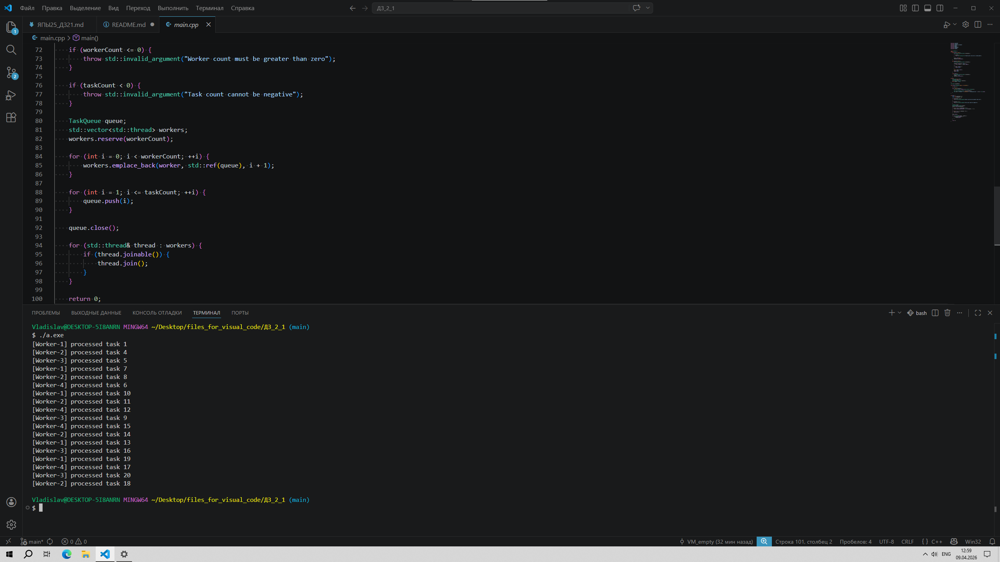

# Отчёт по домашней работе №1

## 1. Титульная информация

**ФИО:** Морозов Владислав Александрович
**Группа:** СКБ_25_1  
**Дисциплина:** Языки программирования  
**Тема работы:** Многопоточность в C++

---

## 2. Постановка задачи

В этой работе нужно было написать консольную программу на C++, которая показывает обработку задач несколькими потоками одновременно.

По условию требовалось:
- сделать потокобезопасную очередь задач;
- создать несколько рабочих потоков;
- добавить в очередь задачи от 1 до 20;
- организовать ожидание потоков, если очередь пуста;
- корректно завершить все потоки после обработки задач.

Для выполнения задания нужно было использовать стандартные средства многопоточности из C++: `std::thread`, `std::mutex`, `std::condition_variable` и `std::unique_lock`.

---

## 3. Описание реализации

Программа состоит из трёх основных частей:
- класса `TaskQueue`;
- функции `worker`, которую выполняют рабочие потоки;
- функции `main`, где создаются потоки и добавляются задачи.

### Общая идея программы

Логика программы довольно простая.  
Главный поток создаёт задачи и складывает их в общую очередь.  
Рабочие потоки по очереди забирают эти задачи, обрабатывают их и выводят результат в консоль.

Таким образом, главный поток отвечает за добавление задач, а рабочие потоки — за их выполнение.

### Как реализована очередь задач

Для хранения задач используется обычная очередь `std::queue<int>`.  
Но так как к ней одновременно обращаются несколько потоков, доступ к ней нужно защищать.

Для этого в классе `TaskQueue` используется:
- `std::mutex` — чтобы только один поток в момент времени работал с очередью;
- `std::condition_variable` — чтобы потоки могли ждать появления новых задач без постоянной проверки;
- флаг `closed`, который показывает, что новые задачи больше добавляться не будут.

В классе есть три основных метода:
- `push()` — добавляет задачу в очередь;
- `pop()` — извлекает задачу из очереди;
- `close()` — закрывает очередь после того, как все задачи добавлены.

### Почему используется condition_variable

Если очередь пустая, поток не должен крутиться в бесконечном цикле и зря нагружать процессор.  
Поэтому в программе используется `std::condition_variable`.

Когда задач нет, поток просто переходит в режим ожидания.  
Как только в очередь добавляется новая задача, один из потоков пробуждается и продолжает работу.

Это удобнее и правильнее, чем постоянно проверять очередь вручную.

### Как работают рабочие потоки

Каждый рабочий поток запускает функцию `worker`.  
Внутри неё поток пытается получить задачу из очереди. Если задача есть, поток «обрабатывает» её одну секунду с помощью `sleep_for`, а затем выводит сообщение в консоль.

## 4. Ссылка на репозиторий
https://github.com/lop1215-maker/My-project/tree/main/%D0%94%D0%97_2_1

## 5. Скриншот

## 6. Выводы
В ходе выполнения этой работы я разобрался с базовыми возможностями многопоточности в C++.

На практике получилось увидеть, как создаются потоки, как защищаются общие данные с помощью мьютекса и как можно организовать ожидание через condition_variable.

Также в работе была реализована потокобезопасная очередь задач и корректное завершение всех потоков после выполнения программы.

В результате получилась программа, которая соответствует условиям задания и показывает, как можно организовать простую многопоточную обработку задач на C++.
